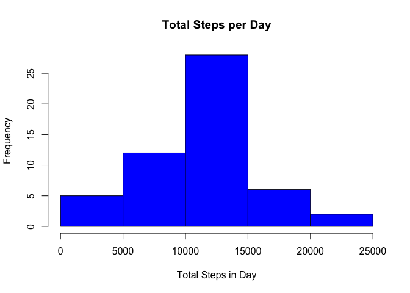
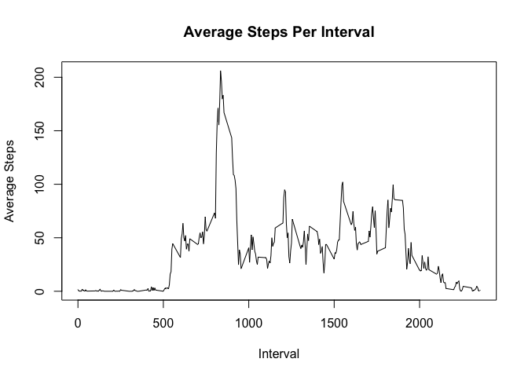
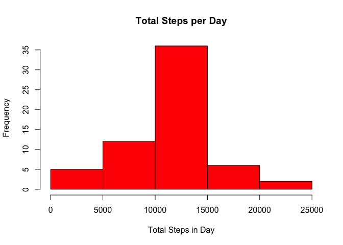
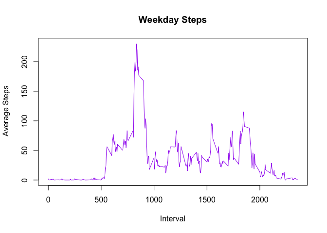
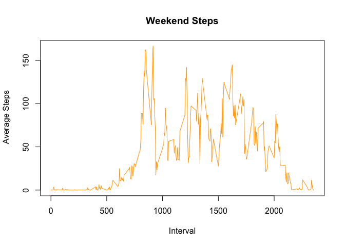

# Peer Assessment 1
Tom Hartshorne  
July 17, 2015  
Loading and Preprocessing the Data

```r
activity = read.csv(file = "activity.csv")
```
Finding the Mean Steps Taken per Day
We can sum up the steps per day by using the aggregate function as so:

```r
summed = aggregate(activity$steps, by= list(date = activity$date), FUN = sum)
```
And then with these sums, we can plot a histogram of the results

```r
hist(summed$x, col = "blue", main = "Total Steps per Day", xlab = "Total Steps in Day")
```

 
To find the mean and median, we use the respective functions as so:

```r
 mean(summed$x, na.rm = TRUE)
```

```
## [1] 10766.19
```

```r
 median(summed$x, na.rm = TRUE)
```

```
## [1] 10765
```

Time Series Plot
First, we must average the steps based on the intervals:

```r
 intervalmeans =aggregate(steps~interval, data=activity, FUN=function(x) c(mean=mean(x)))
```
Next, we plot the averages by interval.

```r
 plot(intervalmeans$interval,intervalmeans$steps, type = "l", main = "Average Steps Per Interval", xlab = "Interval", ylab = "Average Steps")
```

 
The interval containing the maximum number of steps on average is the 835 interval. 

Inputting Missing Values

Total number of missing values

```r
 sum(is.na(activity$steps))
```

```
## [1] 2304
```
Replacing missing values with average for that interval

We accomplish this using a simple function: 

```r
 for (i in 1:17568) {
  if (is.na(activity[i,1])== TRUE) {
    interval = activity[i,3]
    mean = intervalmeans$steps[intervalmeans$interval == interval]
    activity[i,1] = mean
  }
 }
```
Histogram
Using similar code as above, we make our histogram:

```r
 newsummed = aggregate(activity$steps, by= list(date = activity$date), FUN = sum)
 hist(newsummed$x, col = "red", main = "Total Steps per Day", xlab = "Total Steps in Day")
```

 
Same for mean and median

```r
 mean(newsummed$x, na.rm = TRUE)
```

```
## [1] 10766.19
```

```r
 median(newsummed$x, na.rm = TRUE)
```

```
## [1] 10766.19
```
Here we see interestingly that the mean is exactly the same, and the median now has the same value. 

Comparing Weekends to Weekdays
First, we need to add a factor variable to our activity data:

```r
 activity$date = as.Date(activity$date)
 wd = weekdays(activity$date)
 wds = ifelse(wd %in% c("Saturday","Sunday"), "weekend","weekday")
 activitydays = cbind(activity,wds)
```
Then, we need to find the averages for the two categories and split them:

```r
 daysavg = aggregate(activitydays[,1],list(activitydays$wds,activitydays$interval),mean)
 weekendavg = daysavg[ which (daysavg$Group.1 == 'weekend'),]
 weekdayavg = daysavg[ which (daysavg$Group.1 == 'weekday'),]
```
Now that we have seperated the interval averages based on the categories, we can plot the two side by side

```r
 par((mfrow = c(2,1)))
```

```
## NULL
```

```r
 plot(weekdayavg$Group.2,weekdayavg$x, main = "Weekday Steps", xlab = "Interval", ylab =" Average Steps", col = "purple", type = "l")
```

 

```r
 plot(weekendavg$Group.2,weekendavg$x, main = "Weekend Steps", xlab = "Interval", ylab =" Average Steps", col = "orange", type = "l")
```

 
